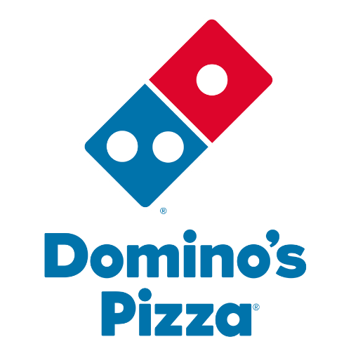
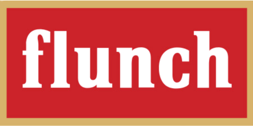
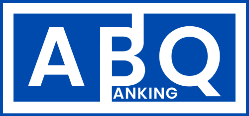
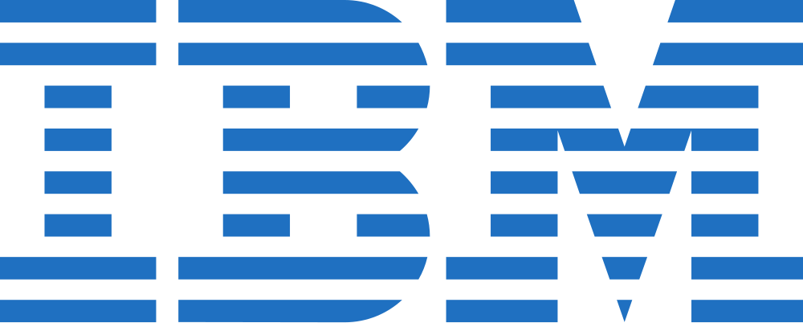

<h2 style="font-size: 22px; font-weight: bold; margin-bottom: 15px; border-bottom: 2px solid #ddd; padding-bottom: 5px;">
    🔧 Compétences Techniques
</h2>
<ul style="list-style: none; padding: 0; margin: 0;">
    <li>💻 <strong>Programmation :</strong> Python, C, R, SQL, PHP, Java</li>
    <li>📊 <strong>Visualisation de Données :</strong> Power BI</li>
    <li>🗄️ <strong>Bases de Données :</strong> MySQL, PostgreSQL</li>
    <li>🌐 <strong>Technologies Web :</strong> HTML, CSS, JavaScript</li>
    <li>📅 <strong>Gestion de Projet :</strong> Jira, Confluence</li>   
    <li>📝 <strong>Bureautique :</strong> Word, Excel, PowerPoint</li>
    <li>📐 <strong>Modélisation & Conception :</strong> UML, Merise</li>
    <li>🖥️ <strong>Systèmes d'exploitation :</strong> Windows, Linux</li>
    <li>📚 <strong>Librairies :</strong> Pandas, NumPy, Matplotlib, Seaborn, Scikit-learn</li>
    <li>🛠️ <strong>Outils de Développement :</strong> Git, VS Code, Visual Studio, IntelliJ</li>
</ul>

 

<h2 style="font-size: 22px; font-weight: bold; margin-top: 30px; margin-bottom: 15px; border-bottom: 2px solid #ddd; padding-bottom: 5px;">
    🛠️ Soft Skills
</h2>
<ul style="list-style: none; padding: 0; margin: 0;">
    <li>✅ Travail en équipe</li>
    <li>🎯 Résolution de problèmes</li>
    <li>💡 Créativité et innovation</li>
    <li>🗣️ Communication efficace</li>
    <li>⏳ Gestion du temps et priorisation</li>
    <li>📊 Esprit analytique</li>
</ul>

<h2 style="font-size: 22px; font-weight: bold; margin-top: 30px; margin-bottom: 15px; border-bottom: 2px solid #ddd; padding-bottom: 5px;">
    🎓 Formation
</h2>

    

        
        

            <h3 style="margin: 0;">EIL Côte d’Opale (2022 – 2027)</h3>
            
École d’ingénieur en Informatique

            
🎓 Diplôme en cours d'obtention

        

    

    <a href="{{ '/assets/docs/DOSSIER ACADÉMIQUE EILCO.pdf' | relative_url }}" download
       style="display: inline-block; text-decoration: none; background: #007bff; color: white; padding: 6px 12px; font-size: 12px; font-weight: bold; border-radius: 5px; text-align: center; display: flex; align-items: center; gap: 5px;">
        <i class="fas fa-graduation-cap"></i>
    </a>

    

        
        

            <h3 style="margin: 0;">Groupe Scolaire Al Hanane IV (2021 – 2022)</h3>
            
Baccalauréat Option Sciences Mathématiques B

            
🎖️ Mention Très Bien

        

    

    <a href="{{ '/assets/docs/ATTESTATION DU BACCALAURÉAT.pdf' | relative_url }}" download
       style="display: inline-block; text-decoration: none; background: #007bff; color: white; padding: 6px 12px; font-size: 12px; font-weight: bold; border-radius: 5px; text-align: center; display: flex; align-items: center; gap: 5px;">
        <i class="fas fa-graduation-cap"></i>
    </a>

<h2 style="font-size: 22px; font-weight: bold; margin-top: 30px; margin-bottom: 15px; border-bottom: 2px solid #ddd; padding-bottom: 5px;">
    💼 Expériences Professionnelles
</h2>

    
    

        <h3 style="margin: 0;">Croix-Rouge (Jan. 2025 – Présent)</h3>
        
Bénévole

    

    Projet solidaire visant à optimiser la collecte et la redistribution des vêtements grâce à une approche data-driven pour maximiser l’impact social.

<ul style="margin-top: 0px;">
    <li><strong>Conçu</strong> et déployé un système de collecte en partenariat avec des points relais stratégiques.</li>
    <li><strong>Exploité</strong> les données de collecte via un dashboard interactif (<strong>Power BI</strong>) et une modélisation prédictive (<strong>Python</strong>) afin d’anticiper les besoins.</li>
    <li><strong>Renforcé</strong> l’engagement communautaire et optimisé la redistribution pour maximiser l’impact social.</li>
</ul>

    
    

        <h3 style="margin: 0;">SRM Souss Massa (Mar 2024 – Avr 2024)</h3>
        
Data Scientist Stagiaire

    

    Stage axé sur l’optimisation de la qualité de l’eau grâce à l’intégration de capteurs IoT et l’analyse prédictive.

<ul style="margin-top: 0px;">
    <li><strong>Collecté</strong> des données en continu (pH, salinité, turbidité) via des <strong>capteurs IoT</strong> sur le réseau de distribution.</li>
    <li><strong>Intégré</strong> et analysé les données en temps réel avec <strong>Python</strong> et des <strong>modèles prédictifs</strong> pour anticiper les fluctuations de qualité.</li>
    <li><strong>Développé</strong> un dashboard interactif (<strong>Power BI</strong>) pour visualiser les tendances et déclencher des alertes en cas d’anomalies.</li>
</ul>

    
    

        <h3 style="margin: 0;">Domino’s Pizza (Juin 2024 – Août 2024)</h3>
        
Livreur Polyvalent

    

    Expérience en préparation et livraison de commandes, assurant un service client optimal dans un environnement dynamique.

<ul style="margin-top: 0px;">
    <li><strong>Préparé</strong> les commandes en respectant les normes de qualité.</li>
    <li><strong>Géré</strong> les livraisons à domicile pour un service client optimal.</li>
    <li><strong>Collaboré</strong> efficacement en équipe pour maintenir un flux de travail performant.</li>
    <li><strong>Géré</strong> le stress et respecté les délais dans un environnement exigeant.</li>
</ul>

    
    

        <h3 style="margin: 0;">Flunch (Décembre 2022 – Avril 2023)</h3>
        
Equipier Polyvalent

    

    Expérience en restauration rapide assurant un service client de qualité et une gestion efficace des opérations en salle.

<ul style="margin-top: 0px;">
    <li><strong>Assuré</strong> le service en salle et la préparation des commandes avec soin.</li>
    <li><strong>Géré</strong> les encaissements et la caisse avec précision et organisation.</li>
    <li><strong>Maintenu</strong> l’hygiène et l’organisation de l’espace de travail.</li>
    <li><strong>Offert</strong> un accueil chaleureux pour garantir la satisfaction client.</li>
</ul>

    
    

        <h3 style="margin: 0;">Club Al Maarifa (Sep. 2020 – Jui. 2022)</h3>
        
Bénévole

    

    Engagement communautaire fort avec coordination d’équipe pour soutenir des actions humanitaires et organiser des événements.

<ul style="margin-top: 0px;">
    <li><strong>Coordonné</strong> des initiatives d’aide alimentaire, collecte de fonds et organisation d’événements.</li>
    <li><strong>Collecté</strong> plus de <strong>10 000 DHS</strong> en organisant une journée cinéma avec des offres marketing stratégiques.</li>
    <li><strong>Optimisé</strong> les coûts et renforcé la cohésion d’équipe pour atteindre des objectifs communs.</li>
</ul>

<h2 style="font-size: 22px; font-weight: bold; margin-top: 30px; margin-bottom: 15px; border-bottom: 2px solid #ddd; padding-bottom: 5px;">
    📌 Projets
</h2>
 

    

        
        <h3 style="margin: 0;">Plateforme de Trading Algorithmique</h3>
    

    <a href="https://github.com/mouad-abaaqil/inoxtrade" target="_blank" 
       style="display: inline-block; text-decoration: none; background: #0366d6; color: white; padding: 6px 12px; font-size: 12px; font-weight: bold; border-radius: 5px; text-align: center; display: flex; align-items: center; gap: 5px;">
        <i class="fab fa-github"></i> Repo
    </a>

    Projet visant à automatiser l’exécution des ordres et optimiser la gestion des risques via une plateforme de trading avancée.

<ul style="margin-top: 0px;">
    <li><strong>Conçu</strong> une plateforme sur <strong>MetaTrader 5</strong> pour exécuter les ordres et calculer dynamiquement les <strong>tailles de lots</strong>.</li>
    <li><strong>Implémenté</strong> des stratégies basées sur l’<strong>analyse technique</strong> et <strong>Smart Money Concepts</strong>, avec backtesting via <strong>Yahoo Finance</strong>.</li>
    <li><strong>Créé</strong> un dashboard interactif sur <strong>Power BI</strong> pour visualiser <strong>trades</strong>, <strong>profits</strong> et <strong>taux de réussite</strong>.</li>
</ul>

    

        
        <h3 style="margin: 0;">Application de Suivi des Finances Personnelles</h3>
    

    <a href="https://github.com/mouad-abaaqil/dirhami" target="_blank" 
       style="display: inline-block; text-decoration: none; background: #0366d6; color: white; padding: 6px 12px; font-size: 12px; font-weight: bold; border-radius: 5px; text-align: center; display: flex; align-items: center; gap: 5px;">
        <i class="fab fa-github"></i> Repo
    </a>

    Application web pour automatiser la gestion financière et la catégorisation des dépenses grâce à l’IA.

<ul style="margin-top: 0px;">
    <li><strong>Développé</strong> une application reliant <strong>API bancaires</strong>, <strong>OCR</strong> et <strong>IA</strong> pour catégoriser les dépenses.</li>
    <li><strong>Automatisé</strong> l’extraction et l’analyse des transactions via l’<strong>API OpenAI</strong>.</li>
    <li><strong>Implémenté</strong> un système d’envoi d’e-mails via <strong>SMTP</strong> pour valider les inscriptions (lien de confirmation).</li>
</ul>

    

        
        <h3 style="margin: 0;">Système de Protection des Colis</h3>
    

    <a href="https://github.com/mouad-abaaqil/tiltalert" target="_blank" 
       style="display: inline-block; text-decoration: none; background: #0366d6; color: white; padding: 6px 12px; font-size: 12px; font-weight: bold; border-radius: 5px; text-align: center; display: flex; align-items: center; gap: 5px;">
        <i class="fab fa-github"></i> Repo
    </a>

    TiltAlert est un dispositif Arduino de détection de chocs et d’inclinaisons, déclenchant des alertes visuelles et sonores pour sécuriser colis et équipements sensibles.

<ul style="margin-top: 0px;">
    <li><strong>Conçu</strong> un système de détection basé sur Arduino et un capteur KY-020 pour surveiller l’inclinaison.</li>
    <li><strong>Programmé</strong> des alertes via buzzer et LED pour signaler des chocs critiques.</li>
    <li><strong>Implémenté</strong> une réinitialisation facile avec un bouton poussoir.</li>
    <li><strong>Démontré</strong> des compétences en électronique et prototypage matériel.</li>
</ul>

    

        
        <h3 style="margin: 0;">Plateforme de Gestion d’Actifs Financiers</h3>
    

    <a href="https://github.com/mouad-abaaqil/ABQ-Banking" target="_blank" 
       style="display: inline-block; text-decoration: none; background: #0366d6; color: white; padding: 6px 12px; font-size: 12px; font-weight: bold; border-radius: 5px; text-align: center; display: flex; align-items: center; gap: 5px;">
        <i class="fab fa-github"></i> Repo
    </a>

    Plateforme de gestion de portefeuille intégrant des technologies avancées pour optimiser les investissements.

<ul style="margin-top: 0px;">
    <li><strong>Développé</strong> une solution de gestion de portefeuille d’investissement sous <strong>Python</strong> et <strong>PostgreSQL</strong>.</li>
    <li><strong>Intégré</strong> des tableaux de bord interactifs en temps réel avec <strong>Power BI</strong>.</li>
    <li><strong>Connecté</strong> une base de données <strong>PostgreSQL</strong> pour une mise à jour dynamique des actifs.</li>
    <li><strong>Analysé</strong> les risques et formulé des recommandations basées sur l’<strong>IA</strong> pour optimiser les investissements.</li>
</ul>

<h2 style="font-size: 22px; font-weight: bold; margin-top: 30px; margin-bottom: 15px; border-bottom: 2px solid #ddd; padding-bottom: 5px;">
    📜 Certifications & Réalisations
</h2>

    

        
        

            <h3 style="margin: 0;">Python for Data Science, AI & Development</h3>
            
IBM

        

    

    <a href="https://www.coursera.org/verify/Y6TEZ5Y7JTL2" target="_blank" 
       style="display: inline-block; text-decoration: none; background: #28a745; color: white; padding: 6px 12px; font-size: 12px; font-weight: bold; border-radius: 5px; text-align: center; display: flex; align-items: center; gap: 5px;">
        <i class="fas fa-check-circle"></i> Vérifier
    </a>

    

        
        

            <h3 style="margin: 0;">Databases and SQL for Data Science with Python</h3>
            
IBM

        

    

    <a href="https://www.coursera.org/verify/GR54MSSMFF7X" target="_blank" 
       style="display: inline-block; text-decoration: none; background: #28a745; color: white; padding: 6px 12px; font-size: 12px; font-weight: bold; border-radius: 5px; text-align: center; display: flex; align-items: center; gap: 5px;">
        <i class="fas fa-check-circle"></i> Vérifier
    </a>

    

        
        

            <h3 style="margin: 0;">Understanding Financial Markets</h3>
            
Université de Genève

        

    

    <a href="https://www.coursera.org/verify/0VXX1XPG41JF" target="_blank" 
       style="display: inline-block; text-decoration: none; background: #28a745; color: white; padding: 6px 12px; font-size: 12px; font-weight: bold; border-radius: 5px; text-align: center; display: flex; align-items: center; gap: 5px;">
        <i class="fas fa-check-circle"></i> Vérifier
    </a>

    

        
        

            <h3 style="margin: 0;">English for Business and Entrepreneurship</h3>
            
University of Pennsylvania

        

    

    <a href="https://www.coursera.org/verify/CMVBDB7LPXB3" target="_blank" 
       style="display: inline-block; text-decoration: none; background: #28a745; color: white; padding: 6px 12px; font-size: 12px; font-weight: bold; border-radius: 5px; text-align: center; display: flex; align-items: center; gap: 5px;">
        <i class="fas fa-check-circle"></i> Vérifier
    </a>

    

        
        

            <h3 style="margin: 0;">Data Science Math Skills</h3>
            
Duke University

        

    

    <a href="https://www.coursera.org/verify/T7562LKTVLVF" target="_blank" 
       style="display: inline-block; text-decoration: none; background: #28a745; color: white; padding: 6px 12px; font-size: 12px; font-weight: bold; border-radius: 5px; text-align: center; display: flex; align-items: center; gap: 5px;">
        <i class="fas fa-check-circle"></i> Vérifier
    </a>

<ul style="list-style: none; padding: 0; margin: 0;">
    <li><strong>🏅 Participation à Kaggle Competitions</strong></li>
    <li><strong>🥇 Lauréat d’un hackathon Data Science</strong></li>
</ul>

<h2 style="font-size: 22px; font-weight: bold; margin-top: 30px; margin-bottom: 15px; border-bottom: 2px solid #ddd; padding-bottom: 5px;">
    🌍 Langues Parlées
</h2>

- 🇦🇪 **Arabe** – Maternelle
- 🇫🇷 **Français** – Avancé
- 🇬🇧 **Anglais** – Courant
- 🇪🇸 **Espagnol** – Élémentaire

<h2 style="font-size: 22px; font-weight: bold; margin-top: 30px; margin-bottom: 15px; border-bottom: 2px solid #ddd; padding-bottom: 5px;">
    🎯 Centres d’Intérêt
</h2>

⚽ **Sports :** Football, Jogging  
🎬 **Vidéographie**  
🌍 **Voyages**  
💡 **Développement Personnel**    
